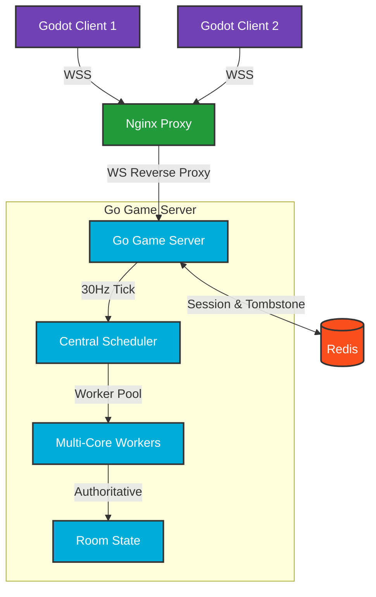

# 💣 PixelBomb — 多人实时联机炸弹人对战引擎

> 基于 Godot 4 客户端与 Go 服务端的高性能、服务端权威（Server-Authoritative）实时对战联机游戏。

[](https://godotengine.org)
[](https://go.dev)
[](https://www.docker.com)
[](LICENSE)

PixelBomb 是一款采用**服务端权威（Server-Authoritative）架构**的多人实时竞技联机游戏。项目集成了 Godot 4 客户端渲染与 Go 语言高频物理 Tick 主循环，实现了精确碰撞、爆炸判定与公平防作弊的一致性保障。支持 Docker 一键全栈部署。

---

## ✨ 核心特性

- 🎮 **服务端权威**：所有移动碰撞、炸弹倒计时、道具拾取及伤害计算均在服务端判定，客户端仅负责预测与插值渲染。
- ⚡ **30Hz Tick Loop**：高频物理循环 + 网络合并打包，毫秒级按键响应。
- 🔌 **异步 I/O 网络层**：基于 Gorilla WebSocket，双缓冲区异步发包，内置慢客户端主动降级断开。
- 🚑 **Tombstone 断线重连**：HMAC 签名 Resume Token + Redis 持久化墓碑，选择性状态恢复，秒级无缝回到战局。
- 🔄 **免清缓存热更新**：Web 端基于 git hash 的版本化资源命名 + manifest.json + Service Worker 缓存策略，用户无需手动清缓存。
- 📊 **Prometheus 监控**：重连成功率、墓碑数量、延迟分布等关键指标实时可观测。
- 🐳 **云原生部署**：多阶段 Dockerfile + Docker Compose（Nginx + Redis + Game Server）一键拉起。

---

## 🎨 系统架构



---

## 🛠️ 技术栈

| 层 | 技术 |
|---|---|
| **客户端** | Godot Engine 4 (GDScript, WebGL2, Web Worker, SharedArrayBuffer) |
| **服务端** | Go (Gorilla WebSocket, 单房间串行 Actor 模型) |
| **缓存 / 持久化** | Redis (Tombstone TTL, 会话缓存) |
| **监控** | Prometheus (自定义 Metrics HTTP 端点) |
| **部署** | Docker, Docker Compose, Nginx |

---

## 🚀 快速开始

### 方式 A：Docker Compose 一键启动（推荐）

```bash
git clone https://github.com/qizh1yang/PixelBomb.git
cd PixelBomb

# 生成 SSL 证书
mkdir -p ssl && openssl req -x509 -nodes -days 365 -newkey rsa:2048 \
  -keyout ssl/key.pem -out ssl/cert.pem -subj "/CN=localhost"

# 启动全部服务
docker-compose up --build -d
```

浏览器访问 `https://localhost` 即可体验。

### 方式 B：开发调试

**后端**：
```bash
cd server
go run main.go
# 默认监听 ws://127.0.0.1:8080/ws
```

**前端**：用 Godot Engine 4.x 打开 `client/project.godot`，按 F5 运行。

---

## 📂 项目结构

```text
PixelBomb/
├── client/                          # Godot 4 客户端
│   ├── autoloads/                   # 全局单例（网络、角色注册、地图注册）
│   ├── scenes/                      # 场景（大厅、房间、仓库、菜单）
│   ├── prefabs/                     # 预制体（玩家、炸弹、背包、HUD）
│   ├── assets/                      # 静态资源
│   ├── utils/network/               # 网络层（连接管理、重连控制、会话恢复）
│   └── export/web/                  # Godot Web 导出目录（gitignored）
├── server/                          # Go 游戏服务器
│   ├── main.go                      # 入口（Redis 初始化、Prometheus、路由）
│   ├── logic/                       # 核心逻辑
│   │   ├── room.go                  # 房间管理（Tombstone、重连、Tick）
│   │   ├── models.go                # 数据模型（PlayerState、SnapshotRestorable）
│   │   └── tombstone_store.go       # 墓碑存储接口与中央清扫器
│   ├── security/
│   │   └── resume_token.go          # HMAC-SHA256 签名 Resume Token
│   ├── storage/
│   │   └── redis_store.go           # Redis 持久化（SETEX + Lua 原子消费）
│   └── metrics/
│       └── reconnect_metrics.go     # Prometheus 重连指标
├── deploy/
│   ├── nginx/
│   │   └── nginx-ssl.conf           # Nginx 配置（WSS 代理 + 缓存策略）
│   ├── web-src/                     # Web 模板源文件（git 跟踪）
│   │   ├── index.html               # 动态版本加载入口
│   │   ├── sw.js                    # Service Worker（三层缓存策略）
│   │   └── version-detector.js      # 版本轮询检测 + 更新 UI
│   ├── scripts/
│   │   └── build-web.js             # Web 构建脚本（版本化 + manifest）
│   └── docs/                        # 部署文档
└── docker-compose.yml
```

---

## 🌐 网络协议

采用 JSON 帧双向 WebSocket 通信：

**客户端上报移动 (`Room.Move`)**：
```json
{
  "route": "Room.Move",
  "data": {
    "x": 256.4, "y": 128.2,
    "vx": 75.0, "vy": 0.0,
    "direction": "right", "tick": 4589
  }
}
```

**服务端下发状态 (`onPlayerStats`)**：
```json
{
  "route": "onPlayerStats",
  "data": {
    "id": "10002",
    "stats": { "bomb_cap": 2, "bomb_current": 1, "speed_current": 75.0 }
  }
}
```

**同步策略**：状态同步 + 客户端预测 + 服务端权威纠偏 + 线性平滑插值。

---

## 🔄 Web 免清缓存热更新

每次 Godot Web 导出后运行构建脚本：

```bash
node deploy/scripts/build-web.js
```

脚本自动完成：
1. 从 `git rev-parse --short HEAD` 获取版本号
2. `index.pck` / `index.wasm` → `game.{hash}.pck` / `game.{hash}.wasm`
3. 生成 `manifest.json`（版本号 + 文件映射 + 文件大小）
4. 从 `deploy/web-src/` 复制模板文件

**缓存策略**：
| 资源类型 | 缓存策略 | Cache-Control |
|---|---|---|
| `manifest.json`, `index.html` | Network-First | `no-store` |
| `game.{hash}.pck/wasm` | Cache-First（不可变） | `immutable, max-age=31536000` |
| 其他静态资源 | Cache-First + 网络回填 | 默认 |

**开发模式**：访问 `?dev=1` 跳过版本化加载，直接使用原始文件名。设置 `window.__CDN_BASE__` 可指定 CDN 资源路径。

---

## 🚑 Tombstone 断线重连系统

玩家断线后服务端保留 **30 秒墓碑（Tombstone）**，保存选择性状态快照：

- **Resume Token**：HMAC-SHA256 签名，格式 `base64url(random32).base64url(HMAC(uid|roomID|expire)).expireUnix`
- **存储**：Redis SETEX（TTL 自动过期）+ Lua 脚本原子 GET+DEL 消费
- **恢复策略**：选择性恢复（位置、装备恢复；死亡/伤害状态保留服务端权威）
- **清扫器**：中央 `TombstoneSweeper`（5s tick），替代逐玩家 goroutine

**重连流程**：
1. 客户端检测断线 → `ReconnectController` 指数退避重试（1s → 30s 上限，最多 8 次）
2. 重连成功 → `SessionRecovery` 5 步管线：重新认证 → 资料恢复 → 背包恢复 → 房间恢复
3. 服务端原子消费 Tombstone，HMAC 验证 Token，选择性应用快照

**客户端优雅退出**：`network_manager.gd` 捕获 `NOTIFICATION_WM_CLOSE_REQUEST`，发送 `Room.Leave` 后关闭连接，避免残留虚假墓碑。

---

## 📊 Prometheus 监控指标

Metrics HTTP 端点（默认端口可配置）：

| 指标 | 类型 | 说明 |
|---|---|---|
| `pixelbomb_tombstone_created_total` | Counter | 创建的墓碑总数 |
| `pixelbomb_tombstone_resumed_total` | Counter | 成功恢复的墓碑总数 |
| `pixelbomb_tombstone_expired_total` | Counter | 过期清理的墓碑总数 |
| `pixelbomb_resume_failed_total` | CounterVec | 重连失败次数（按 reason 分类） |
| `pixelbomb_active_tombstones` | Gauge | 当前活跃墓碑数量 |
| `pixelbomb_resume_latency_seconds` | Histogram | 重连延迟分布 |

---

## 📄 API 路由

| Route | 方向 | 说明 |
|---|---|---|
| `Room.Move` | Client → Server | 玩家移动输入 |
| `Room.PlaceBomb` | Client → Server | 放置炸弹 |
| `Room.Join` | Client → Server | 加入房间 |
| `Room.Leave` | Client → Server | 离开房间 |
| `Room.Resume` | Client → Server | 断线重连（携带 Resume Token） |
| `onPlayerStats` | Server → Client | 玩家属性同步 |
| `onPlayerJoin` / `onPlayerLeave` | Server → Client | 玩家进出通知 |
| `onBomb` / `onExplosion` | Server → Client | 炸弹/爆炸事件 |
| `onDeath` / `onGameOver` | Server → Client | 死亡/游戏结束 |

---

## 🗺️ 路线图

- [x] 多人实时对战物理 Tick 同步
- [x] 背包初始战斗能力（Caps）解算
- [x] Tombstone 断线重连 + HMAC Token + Redis 持久化
- [x] Web 免清缓存热更新（版本化资源 + SW + manifest）
- [x] Prometheus 监控指标
- [ ] PVE 匹配系统与机器人
- [ ] 全局排位天梯（Elo 结算）
- [ ] 客户端反外挂与服务端输入校验

---

## 💬 常见问题

**Q: 网页加载卡在 `SharedArrayBuffer` 报错？**
A: Godot 4 Web 多线程需要跨源隔离。Nginx 必须配置 `Cross-Origin-Opener-Policy: same-origin` 和 `Cross-Origin-Embedder-Policy: require-corp`。使用本项目 `deploy/nginx/nginx-ssl.conf` 即可。

**Q: WebSocket 连接失败？**
A: 确保服务端已启动（默认 `:8080`）。云部署需放行 80/443 端口，且必须使用 WSS 安全连接（带 SSL 证书），否则浏览器会拦截 WS 明文握手。

**Q: 高延迟玩家会拖卡其他人吗？**
A: 不会。单房间异步队列设计，高延迟玩家的发包积压只会触发自身 Session 缓冲区溢出被主动断开，不影响房间 Tick 主循环。

**Q: 每次更新客户端需要重启 Nginx 吗？**
A: 不需要。Nginx 直接从磁盘读取静态文件，替换 `client/export/web/` 下的文件后运行 `build-web.js` 即可，无需重启任何服务。

---

## 📄 许可证

本项目基于 [MIT License](LICENSE) 协议开源。
