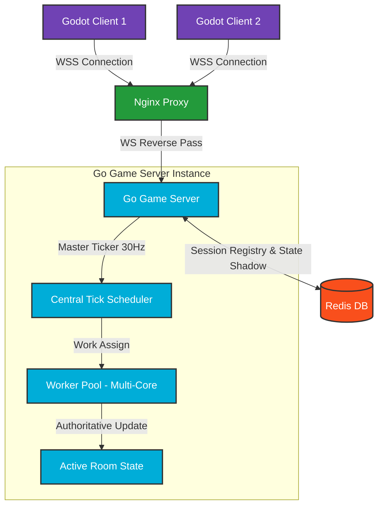

# 💣 PixelBomb - 多人实时联机炸弹人对战引擎

> 基于 Godot 4 客户端与 Go 语言服务端的高性能、服务端权威（Server-Authoritative）实时对战联机游戏。

[](https://godotengine.org)
[](https://go.dev)
[](https://www.docker.com)
[](LICENSE)

PixelBomb 是一款采用**服务端权威（Server-Authoritative）架构**的多人实时竞技联机游戏。项目集成了 Godot 4 高清多线程前端渲染与 Go 语言的高频物理 Tick 主循环，实现了在极低延迟环境下的精确碰撞、爆炸判定与公平防作弊的一致性保障。支持 Docker 一键式全栈部署，适合作为多人联机对战游戏的脚手架与参考范式。

---

## ✨ 项目亮点 (Features)

*   🎮 **局内绝对公平（Server-Authoritative）**：所有的移动碰撞、炸弹倒计时、道具拾取以及伤害计算均在服务端权威判定，客户端仅负责物理预测与插值渲染，从源头杜绝本地数据篡改与外挂。
*   ⚡ **高频帧更新（30Hz Tick Loop）**：服务端采用 30Hz 高频物理循环，结合网络合并打包机制，提供极其平滑、毫无卡顿的毫秒级按键响应体验。
*   🔌 **零死锁异步 I/O 网络层**：基于 Gorilla WebSocket 构建了高吞吐、双缓冲区异步发包网络模型，内置慢客户端（Slow Client）主动降级断开防御，确保流畅玩家不受卡顿网络拖累。
*   🚑 **无感断连状态追赶 (Reconnect Catchup)**：支持玩家因移动网络抖动掉线的 Tombstone 墓碑保留机制，重连时瞬间下发全局 GameState 最新快照，实现秒级无缝回到战局。
*   🐳 **云原生一键上线**：提供开箱即用的多阶段极简安全 Dockerfile，通过 Docker Compose 编排实现 Game-Server、Redis 和 Nginx 接入反向代理的秒级拉起。

---

## 🎨 系统架构 (Architecture)



---

## 🛠️ 技术栈 (Tech Stack)

*   **Frontend**: Godot Engine 4 (GDScript, WebGL2 + Web Worker, SharedArrayBuffer 多线程)
*   **Backend**: Go (Gorilla WebSocket, 高并发无锁单房间串行 Actor 模型)
*   **Infra**: Docker, Docker Compose, Nginx, Redis 缓存

---

## 🚀 快速开始 (Quick Start)

### 方法 A：Docker Compose 一键全栈启动 (推荐)
只需一条命令，即可在本地或云服务器拉起包括 Nginx、Redis、Web 前端与 Go 后端在内的完整对局环境：

1. 克隆本项目：
   ```bash
   git clone https://github.com/your-repo/PixelBomb.git
   cd PixelBomb
   ```
2. 生成 SSL 证书支持 WSS 安全连接：
   ```bash
   mkdir -p ssl && openssl req -x509 -nodes -days 365 -newkey rsa:2048 -keyout ssl/key.pem -out ssl/cert.pem -subj "/CN=localhost"
   ```
3. 启动服务：
   ```bash
   docker-compose up --build -d
   ```
   *打开浏览器访问 `https://localhost`，即可直接联机体验游戏！*

---

### 方法 B：分开独立启动开发调试

#### 1. 运行后端服务 (Go Server)
1. 确保安装了 Go 1.20+
2. 进入后端目录并运行：
   ```bash
   cd server
   go run main.go
   ```
   *服务将默认监听在 `ws://127.0.0.1:8080/ws`*

#### 2. 运行前端客户端 (Godot Client)
1. 使用 Godot Engine 4.x 打开 `client/project.godot`。
2. 在编辑器内点击 **运行 (F5)** 即可连接到本地运行的服务端。

---

## 📂 项目结构 (Project Structure)

```text
PixelBomb/
├── client/              # 🎮 Godot 4 客户端工程 (GDScript)
│   ├── assets/          # 声音与美术静态资源
│   ├── autoloads/       # 网络协议同步单例 (Network.gd)
│   ├── scenes/          # 菜单、大厅、主界面场景
│   └── stages/          # 战斗关卡物理地图
├── server/              # 🚀 Go WebSocket 游戏服务器 (Nano)
│   ├── cmd/game/        # 后端启动程序主入口
│   ├── logic/           # 局内核心 Tick 计算、碰撞拾取逻辑包
│   └── Dockerfile       # 多阶段极简安全生产 Dockerfile
├── deploy/              # ⚙️ DevOps 部署与集成层
│   ├── nginx/           # Nginx 安全反向代理配置文件
│   ├── docs/            # HTTPS SSL 部署与大内存调优说明文档
│   └── scripts/         # 自动签发证书、Linux Swap 快速设置脚本
└── docker-compose.yml   # 🐳 一键容器化编排服务配置
```

---

## 🌐 网络协议与同步机制 (Networking)

### 1. 消息协议定义 (JSON Frame)
前后端采用轻量 JSON 帧进行双向 WebSocket 消息传递：

*   **客户端上报移动状态 (`Room.Move`)**：
    ```json
    {
      "route": "Room.Move",
      "data": {
        "x": 256.4,
        "y": 128.2,
        "vx": 75.0,
        "vy": 0.0,
        "direction": "right",
        "tick": 4589
      }
    }
    ```
*   **服务端下发 Tick 物理纠偏与属性 (`onPlayerStats`)**：
    ```json
    {
      "route": "onPlayerStats",
      "data": {
        "id": "10002",
        "stats": {
          "bomb_cap": 2,
          "bomb_current": 1,
          "speed_current": 75.0,
          "shield_current": 0
        }
      }
    }
    ```

### 2. 同步思想
系统采用 **“状态同步 (State Synchronization)”** 策略。客户端本地通过移动输入进行预测和先发渲染（Client Prediction），当服务端 30Hz 主 Tick 发送权威坐标时，客户端采用**线性平滑插值（Lerp Interpolation）**向服务端权威坐标对齐。

---

## 🗺️ 发展路线图 (Roadmap)

- [x] 多人实时对战物理 Tick 同步与爆砖掉落
- [x] 基于背包的初始战斗能力（Caps）解算
- [x] 断线重连与全量快照自动追赶机制
- [ ] 🤖 **PVE 匹配系统与机器人占位逻辑** (进行中)
- [ ] 🏆 **全局排位梯队与天梯竞技分 (Elo) 数据库结算**
- [ ] 🛡️ **客户端操作多层反外挂与服务端输入校验**

---

## 💬 常见问题 (FAQ)

#### Q1: 部署到云服务器后，网页加载卡在进度条提示 `SharedArrayBuffer` 报错？
*   **A**: 这是因为 Godot 4 Web 端多线程需要浏览器开启高强度跨源隔离。Nginx 必须配置并添加 `Cross-Origin-Opener-Policy same-origin` 和 `Cross-Origin-Embedder-Policy require-corp` Headers。使用本项目自带的 `deploy/nginx/nginx-ssl.conf` 部署即可自动规避该问题。

#### Q2: 本地分开启动时，前端提示连接 WebSocket 失败？
*   **A**: 请确保你的 `server` 服务处于运行状态（默认监听 `:8080`）。若是云部署，请确保你的云安全组已放行 **80**, **443** 端口，并且你必须使用带有合法或自签名 SSL 证书的 **WSS** 安全连接，否则部分现代浏览器会因安全规则拦截 WS 明文握手。

#### Q3: 多人同屏战斗时，个别玩家延迟高，会拖卡其他人吗？
*   **A**: **绝对不会**。服务端采用了无锁的单房间异步队列，任何高延迟或丢包玩家的发包积压只会触发其自己 Session 的缓冲区（`SendChan`）溢出，导致被服务器主动降级并安全断线，而不会占用房间公共 Tick 主循环的任何毫秒数。

---

## 📄 开源许可证
本项目根据 **[MIT License](LICENSE)** 协议授权开源。
